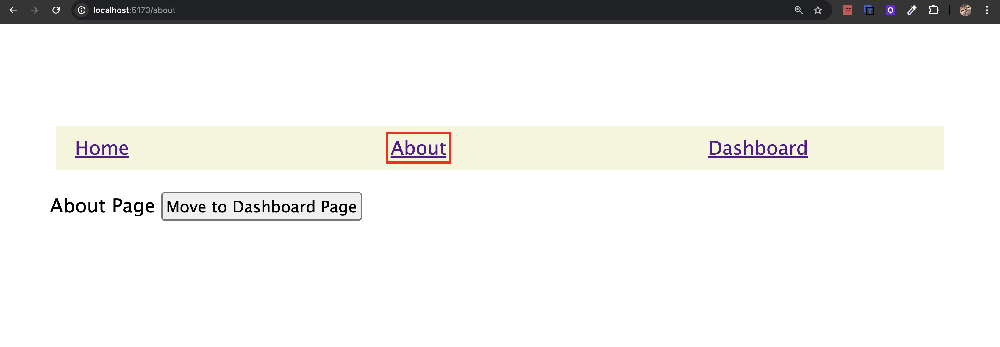

Routing -> To travel to different pages there a multiple routes(paths) defined, to access these is called routing.
createBrowserRouter -> To create routes
Doesn't get refresh, dynamically locates to required UI

useParams -> To handle parameters, example -> www.google.com/id -> url / route parameter
                                   example -> www.google.com/id=12 -> query parameter

useNavigation -> Moving from one page to another dynamically (Nav Hook)

Nested Routing -> Layered by layered movement. example -> home/exams, home/fees, home/result

# React + Vite

This template provides a minimal setup to get React working in Vite with HMR and some ESLint rules.

Currently, two official plugins are available:

- [@vitejs/plugin-react](https://github.com/vitejs/vite-plugin-react/blob/main/packages/plugin-react) uses [Babel](https://babeljs.io/) for Fast Refresh
- [@vitejs/plugin-react-swc](https://github.com/vitejs/vite-plugin-react/blob/main/packages/plugin-react-swc) uses [SWC](https://swc.rs/) for Fast Refresh

## Expanding the ESLint configuration

If you are developing a production application, we recommend using TypeScript with type-aware lint rules enabled. Check out the [TS template](https://github.com/vitejs/vite/tree/main/packages/create-vite/template-react-ts) for information on how to integrate TypeScript and [`typescript-eslint`](https://typescript-eslint.io) in your project.
