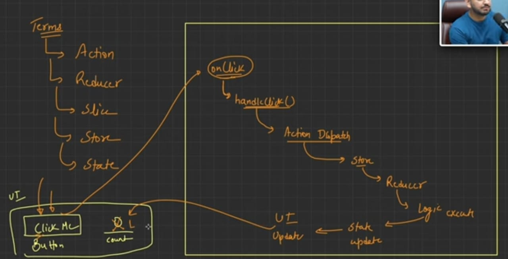
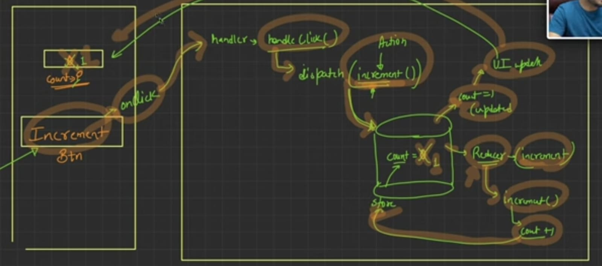
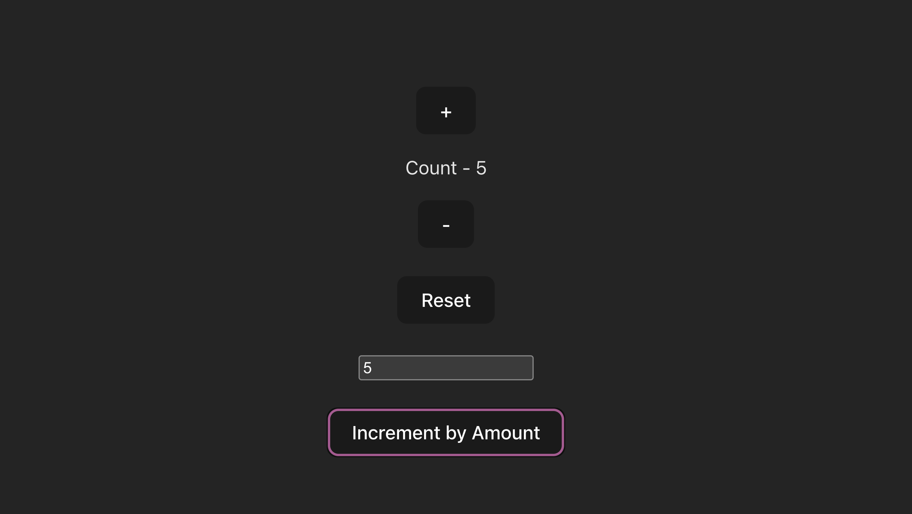

Redux Toolkit -> To manage states(data being managed by app) till now, was by using props, provider and consumer.

Prop drilling : A component being moved causing loss of props
Sol : Rather than sending data via props, send using single source and truth.

Centralized store : A place to maintain states [ Mange, access, update and retrieve ].

Action : Events wrapping with additional info into a block [MoveOver, Hover etc].
Reducer : Functions containing logic to update data.
Slice : App having multiple features (auth, reset etc), maintaining such features states are present in slice. -> Initial state and reducer functions
Store : Single source of truth containing all data and states of it.
State : Fancy name of data -> track, update etc.

Install these:
npm install @reduxjs/toolkit
npm install react-redux

Steps:
1 -> Create Store
2 -> Wrap APP component in PROVIDER tag, so that we can access store 
3 -> Create slice for features
4 -> Exported Reducer should be registered in store

# React + Vite

This template provides a minimal setup to get React working in Vite with HMR and some ESLint rules.

Currently, two official plugins are available:

- [@vitejs/plugin-react](https://github.com/vitejs/vite-plugin-react/blob/main/packages/plugin-react) uses [Babel](https://babeljs.io/) for Fast Refresh
- [@vitejs/plugin-react-swc](https://github.com/vitejs/vite-plugin-react/blob/main/packages/plugin-react-swc) uses [SWC](https://swc.rs/) for Fast Refresh

## Expanding the ESLint configuration

If you are developing a production application, we recommend using TypeScript with type-aware lint rules enabled. Check out the [TS template](https://github.com/vitejs/vite/tree/main/packages/create-vite/template-react-ts) for information on how to integrate TypeScript and [`typescript-eslint`](https://typescript-eslint.io) in your project.
